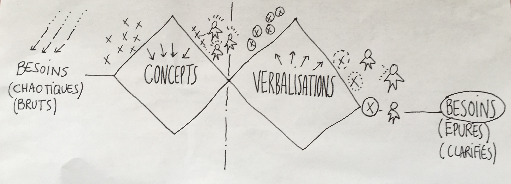
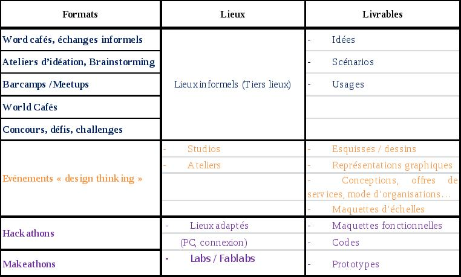

# Atelier APIE du 16 juin 2016

## Nouveaux formats d'innovation métier

* Présentation APIE: [Présentation Pdf](medias/2016-16-16_nouveaux formats de l'innovation.pdf)
* Présentation VDP: sur demande
* Synthèse: [Synthèse Pdf](medias/Synthese.pdf), [Synthèse Docx](medias/Synthese.docx)
* Résultat du Double Diamant: [Double Diamant](medias/DD.pdf)

Des formats nouveaux d’innovation, plus collaboratifs et ouverts, se développent, y compris au sein de l’administration. Accélérateurs de l’innovation, ces nouveaux formats posent également des défis pour les administrations souhaitant les expérimenter. 
----------
Cet événement s’adresse aux agents publics impliqués dans des démarches d’innovation, notamment liées à la conception et au prototypage de solutions expérimentales en réponse à des besoins métier (solutions techniques, méthodes, procédés, bonnes pratiques). L’atelier présente une revue de ces nouveaux formats et leurs origines. Il est illustré par des exemples en France et à l’international, avec une attention particulière sur des séquences d’innovation détaillées par leurs initiateurs. 

# Matinée APIE du 1er décembre 2015

## Nouveaux formats de collaboration entre Etudiants, Agents et Entités Publiques

* Synthèse de la matinée: [Synthèse Pdf](medias/NxF-synthese.pdf), [Synthèse ODT](medias/NxF-synthese.odt), [Synthèse DOCX](medias/NxF-synthese.docx) 
* Présentation APIE: [Présentation Pdf](medias/NxF-pres.pdf), [Présentation ODP](medias/NxF-pres.odp), [Présentation PPTX](medias/NxF-pres.pptx)
* Présentation de Didier Pradon: [aphp.pdf](medias/aphp.pdf)
* Présentation de Sophie Pène: (verbatim disponible sur demande)

De nombreuses entités publiques mènent des projets d’innovation visant à améliorer la qualité des services publics au profit des usagers, mais aussi à créer de nouvelles méthodes de travail, voire des inventions techniques facilitant l’exécution des missions des agents. 

Ces entités pourraient utilement bénéficier des compétences  d’étudiants au cours de leurs projets dans un esprit d’innovation ouverte. Les établissements d’enseignement supérieurs sont également intéressés de faire collaborer leurs étudiants autour de projets initiés par une administration dans le cadre d’un projet pédagogique. Dans ce cadre, de nouveaux formats de collaboration se développent : 

### Thématiques abordées
* Quels sont ces nouveaux formats (idéation, codesign, hackathon, ...)
* Comment les mettre en oeuvre
* Dans quels lieux les accueillir ?

### Thématiques envisagées pour de futurs groupes de travail
* Validation des savoirs acquis dans les Tiers Lieux (fablabs, ...)
* Documentation (méthodes, protocoles, outils, réutilisation)
* Tiers Lieux (définition, mise en oeuvre, fédération)
